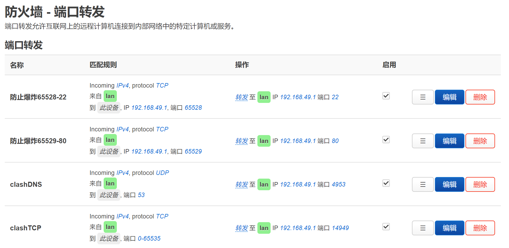

# R2s 手动安装 clash 的记录
~~虽说是r2s，理论上所有 openwrt 都适用~~

## 下载一些文件备用

clash 内核
配置文件
GEOIP

## 检查你的 clash 配置文件

其中 `redir-port: 14949 allow-lan: true dns-listen: 0.0.0.0:4953` 很重要，我建议直接照抄全文。

```yaml
mixed-port: 4949
redir-port: 14949
allow-lan: true
ipv6: false
log-level: warning
mode: rule
keep-alive-interval: 1800
unified-delay: true
tcp-concurrent: true
global-client-fingerprint: random
dns:
  enable: true
  listen: 0.0.0.0:4953
  ipv6: false
  enhanced-mode: fake-ip
  fake-ip-range: 22.49.0.1/16
  prefer-h3: true
  default-nameserver:
    - 223.5.5.5
  nameserver:
    - https://dns.alidns.com/dns-query
    - https://doh.pub/dns-query
sniffer:
  enable: true
  force-dns-mapping: true
  parse-pure-ip: true
  override-destination: true
  sniff:
    HTTP:
      ports: [80, 8080]
    TLS:
      ports: [443, 8443]
  skip-domain:
    - Mijia Cloud
```

## 安装 immortalWrt

这是一个针对国人修改过的 openwrt。https://downloads.immortalwrt.org

https://help.mirrors.cernet.edu.cn/immortalwrt/

ssh 进入，进行改源和更改 lan ip 操作

```sh
sed -e 's,https://downloads.immortalwrt.org,https://mirrors.cernet.edu.cn/immortalwrt,g' \
    -e 's,https://mirrors.vsean.net/openwrt,https://mirrors.cernet.edu.cn/immortalwrt,g' \
    -i.bak /etc/opkg/distfeeds.conf


uci set network.lan.ipaddr='192.168.49.1'
uci commit network
poweroff
```

## 联网前期配置和安装 clash

更改dns 223.6.6.6 执行一下命令

```
opkg update
opkg install curl
echo 1 > /etc/init.d/clash-r2s
chmod 700 /etc/init.d/clash-r2s
```

更改 /etc/init.d/clash-r2s 内容为

```sh
#!/bin/sh /etc/rc.common

USE_PROCD=1
START=99

start_service() {
        procd_open_instance
        procd_set_param respawn
        procd_set_param command /root/clash-r2s/mihomo-linux-arm64 -d /root/clash-r2s -ext-ui /root/clash-r2s/49ui -ext-ctl 0.0.0.0:4990
        procd_close_instance
}
```

把 clash 那堆东西复制到 /root/clash-r2s ，整个文件夹变成 777 权限，启动 clash

```
service clash-r2s enable
service clash-r2s start
```

## 按图设置端口转发


